## Data Flow Diagram
### High-Level
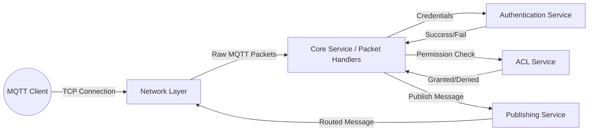

### Mid-Level
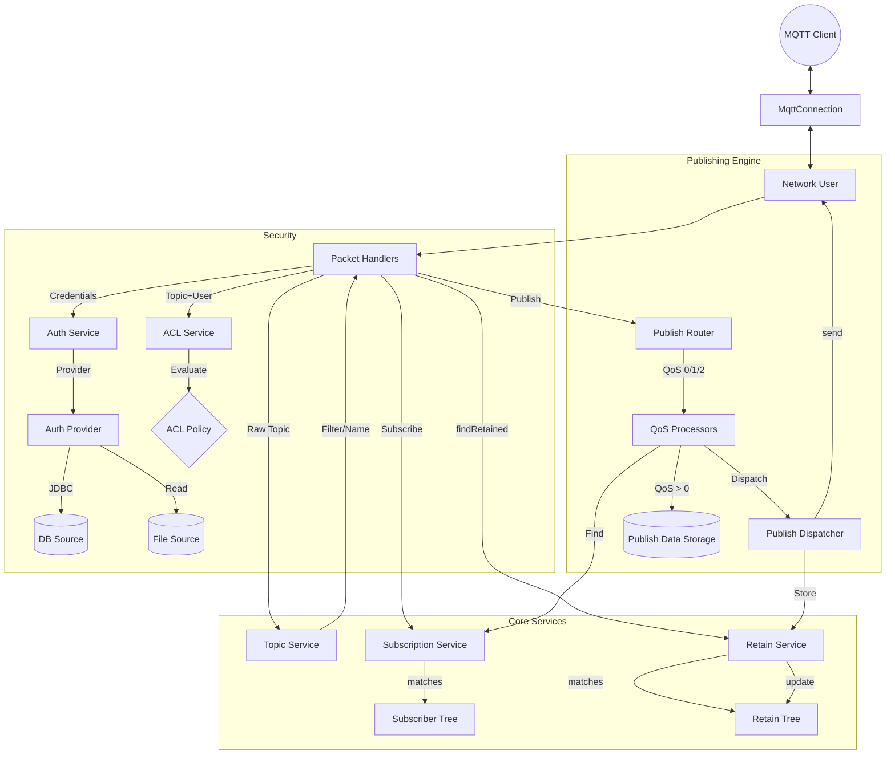

## Sequence Diagrams
### Client Connection & Publish
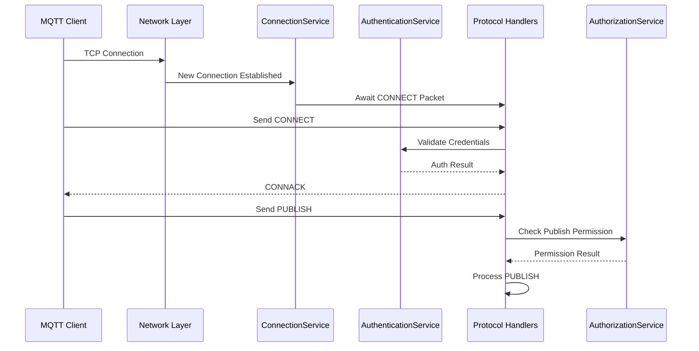

### Subscription Flow
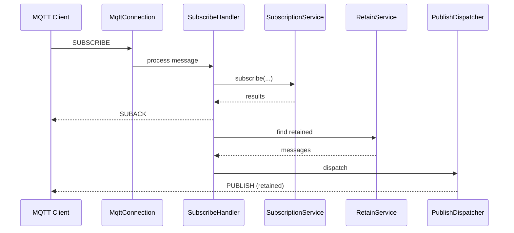

### QoS 1 & 2 Handshake
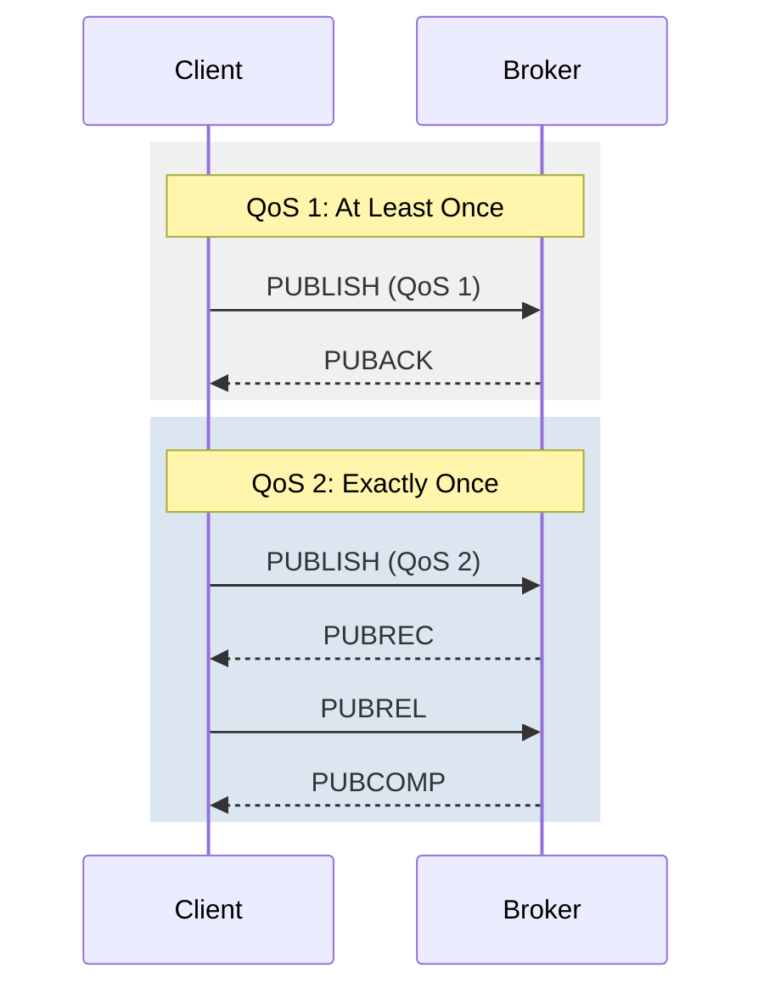

### Session & Message Tracking
Manages the state of QoS 1/2 messages, ensuring "Exactly Once" delivery and handling Packet ID lifecycle.
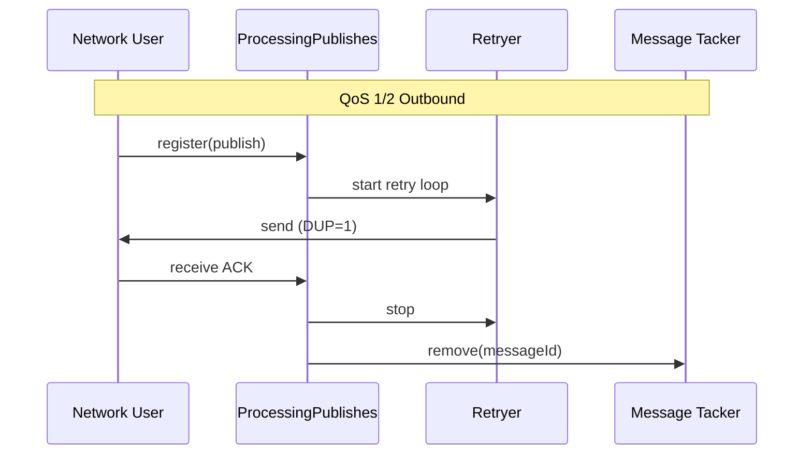

### Disconnect & Will Message (LWT)
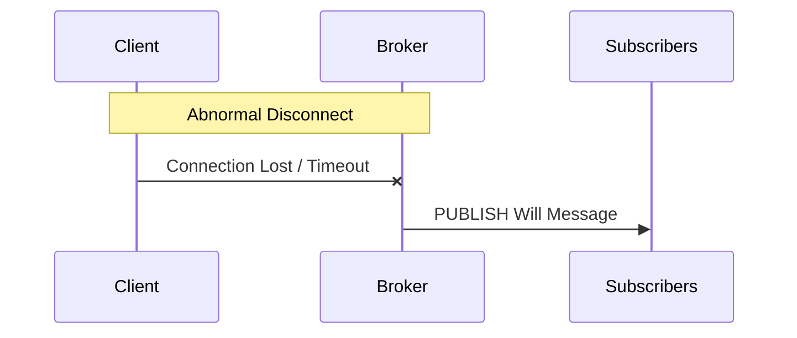

### Unsubscribe & Ping
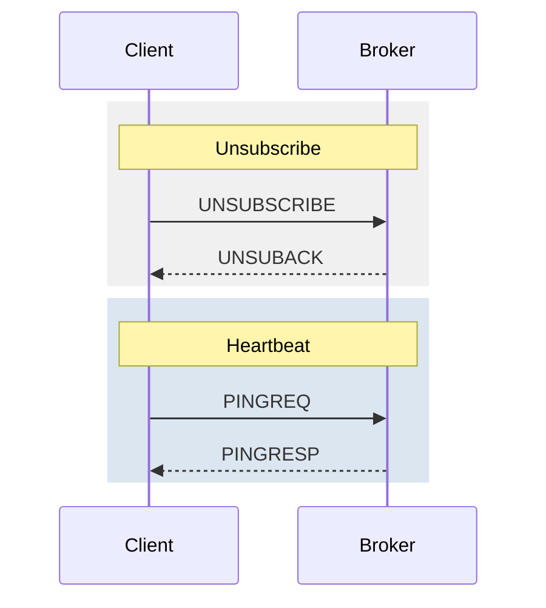

## UML Activity Diagram: Message Processing
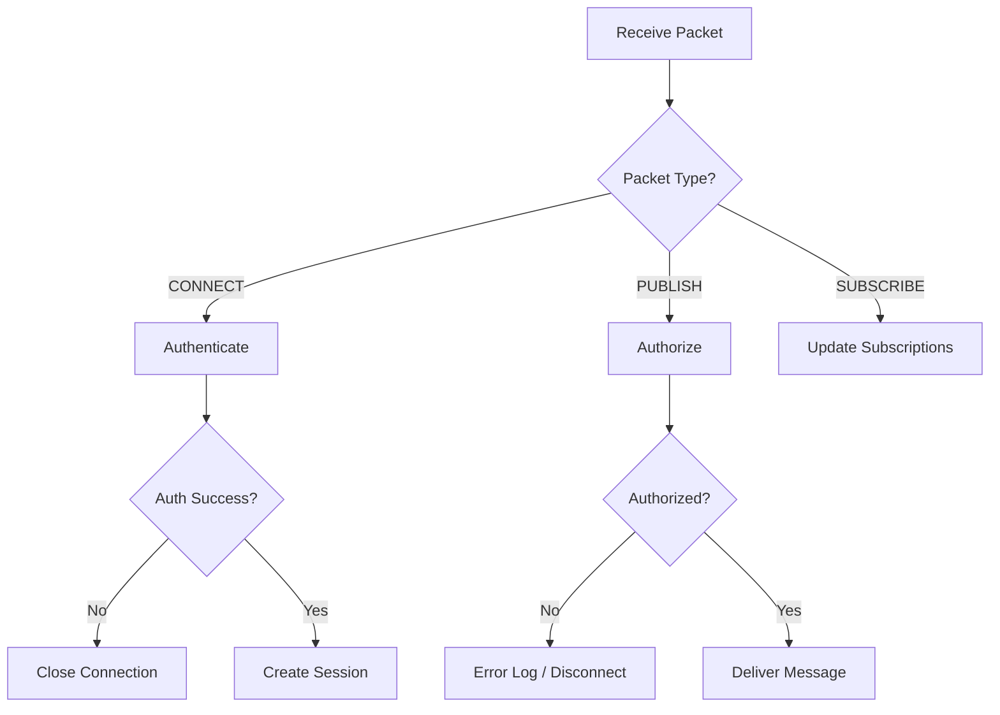

## State Machine: Client Session
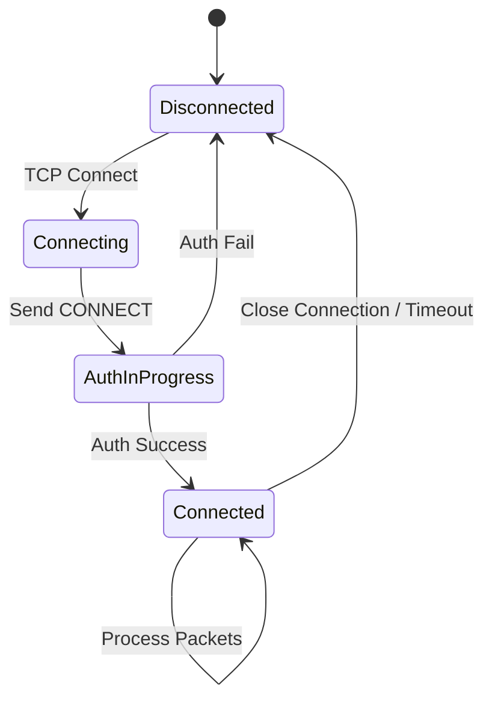

## Component Diagram
Shows the modular structure of the broker and dependencies between modules.
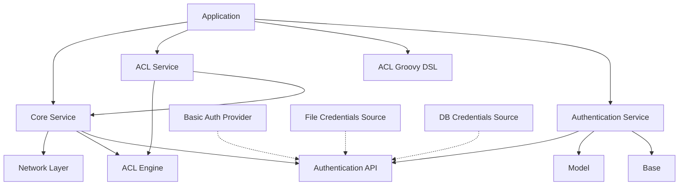

## Deployment Diagram
Typical deployment structure of the MQTT Broker.
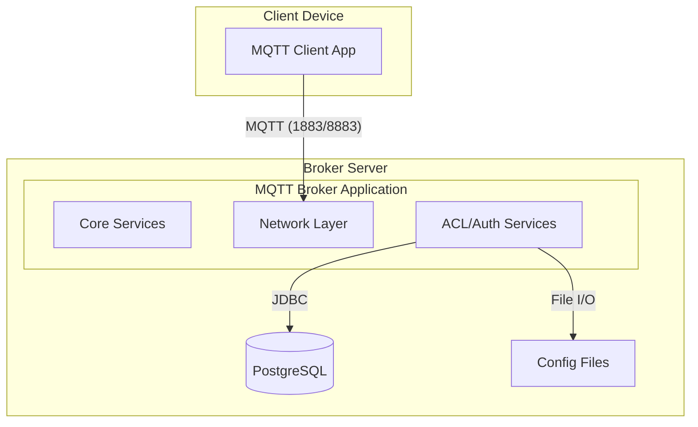
