## Data Flow Diagram
### High-Level
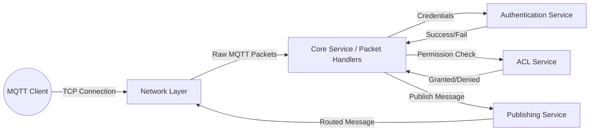

### Mid-Level
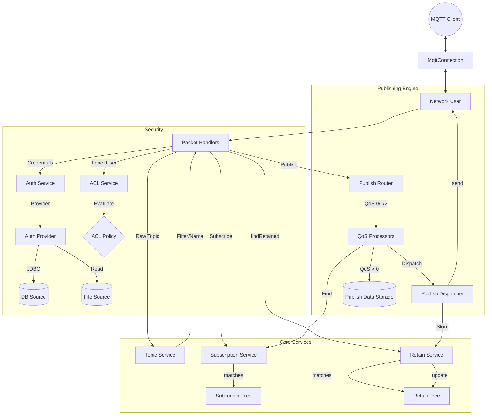

## Sequence Diagrams
### Client Connection & Publish
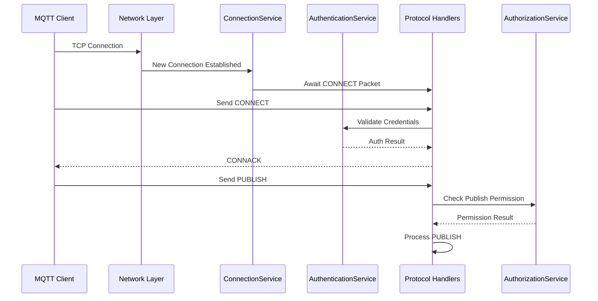

### Subscription Flow
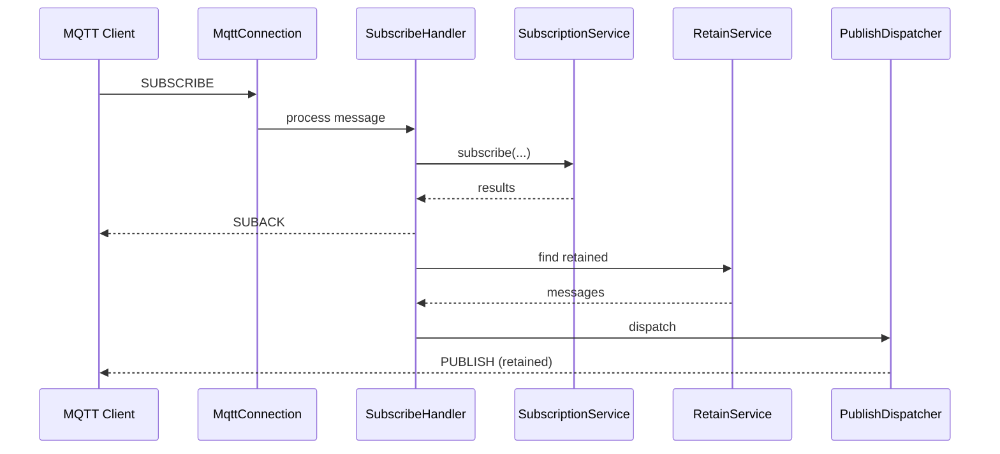

### QoS 1 & 2 Handshake
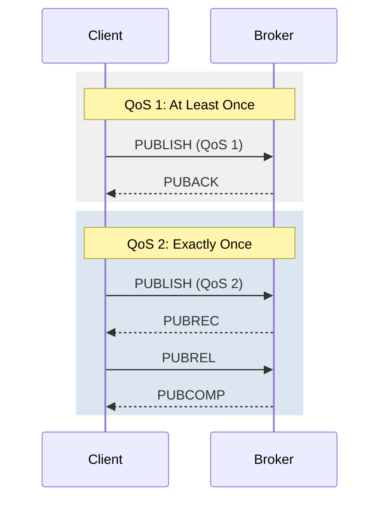

### Session & Message Tracking
Manages the state of QoS 1/2 messages, ensuring "Exactly Once" delivery and handling Packet ID lifecycle.
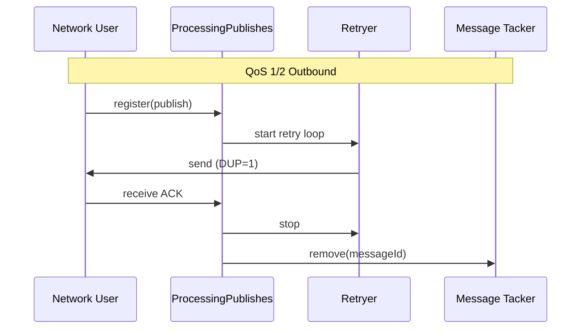

### Disconnect & Will Message (LWT)
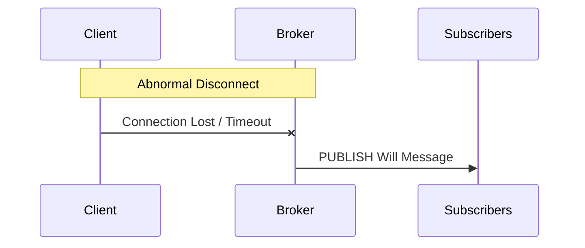

### Unsubscribe & Ping
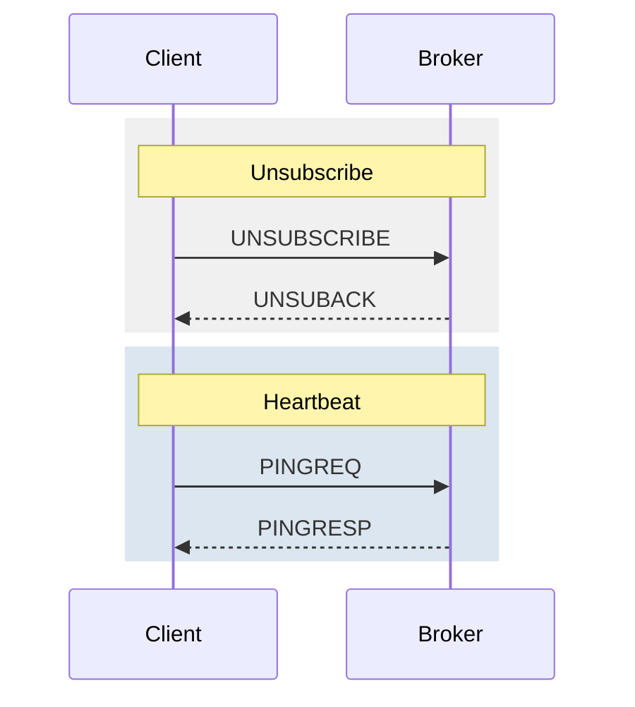

## UML Activity Diagram: Message Processing
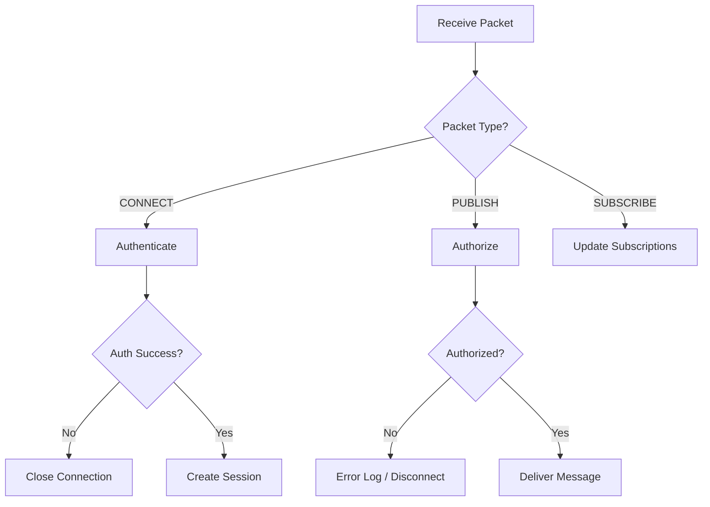

## State Machine: Client Session
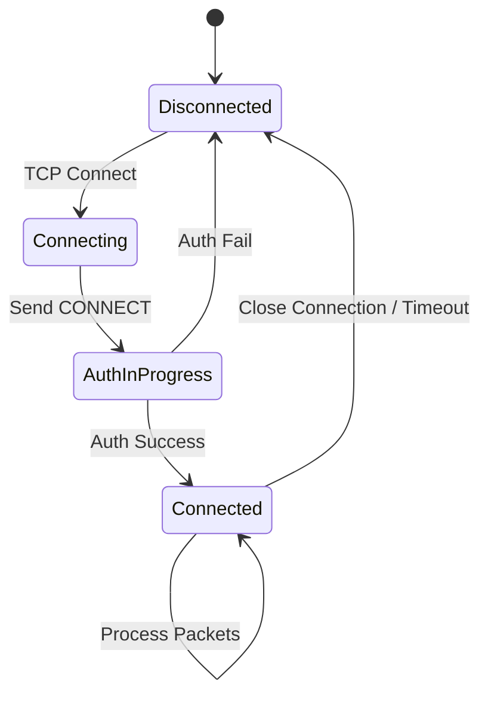

## Component Diagram
Shows the modular structure of the broker and dependencies between modules.
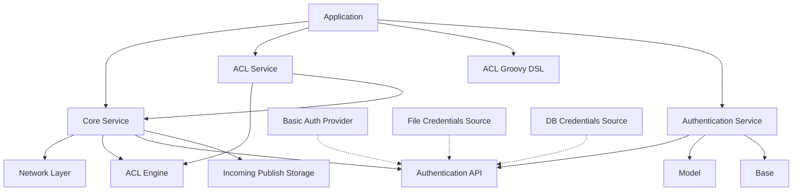

## Deployment Diagram
Typical deployment structure of the MQTT Broker.
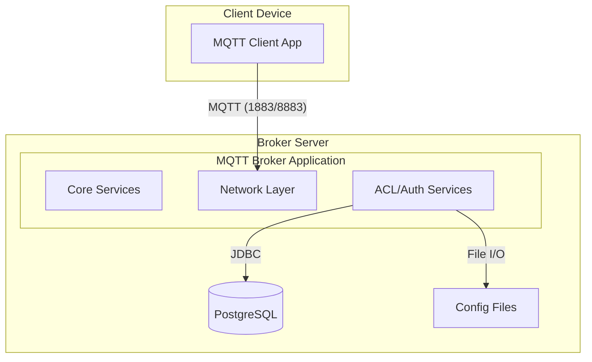

## Incoming Publish Storage
This service provides a centralized global store for incoming `PUBLISH` messages, ensuring safe multi-consumer tracking and lifecycle management (especially for retained messages).

### Message Processing Data Flow
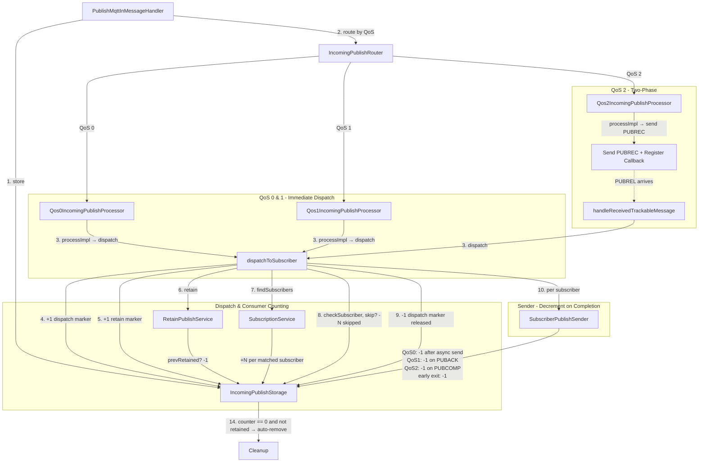

### Storage Lifecycle & Consumer Counting
This diagram illustrates the lifecycle of a `PUBLISH` message and how the reference counter in `IncomingPublishStorage` is managed during dispatch.

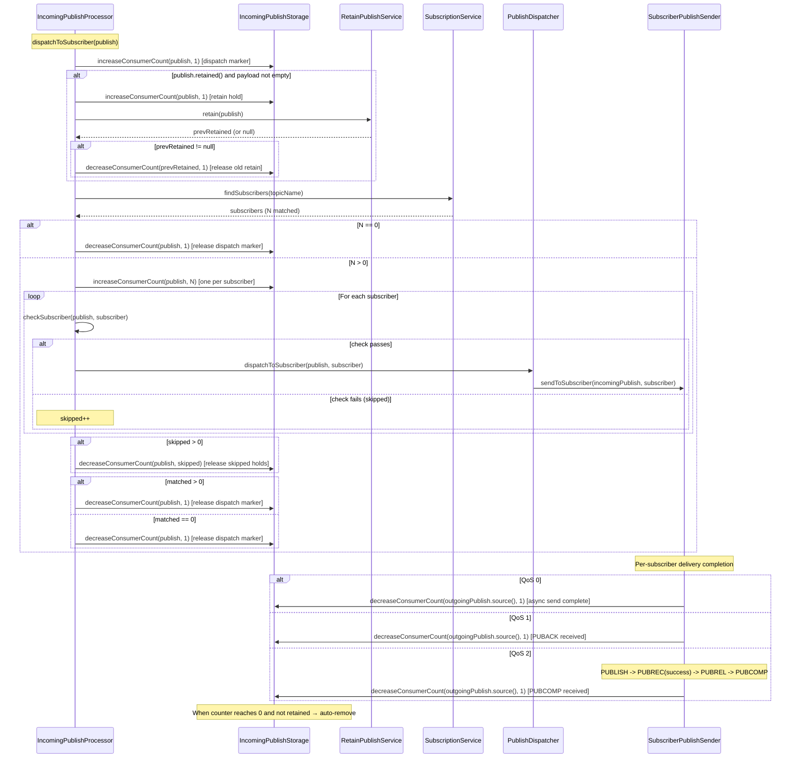

### QoS 2 Inbound Two-Phase Processing
QoS 2 splits processing into two phases: receiving the PUBLISH (sending PUBREC) and processing on PUBREL.

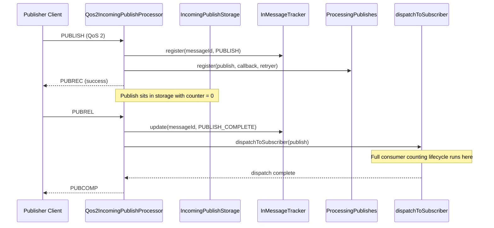

### Sender Error & Early-Exit Paths
Every terminal path in the sender must decrement the consumer count. This diagram shows the non-happy paths.

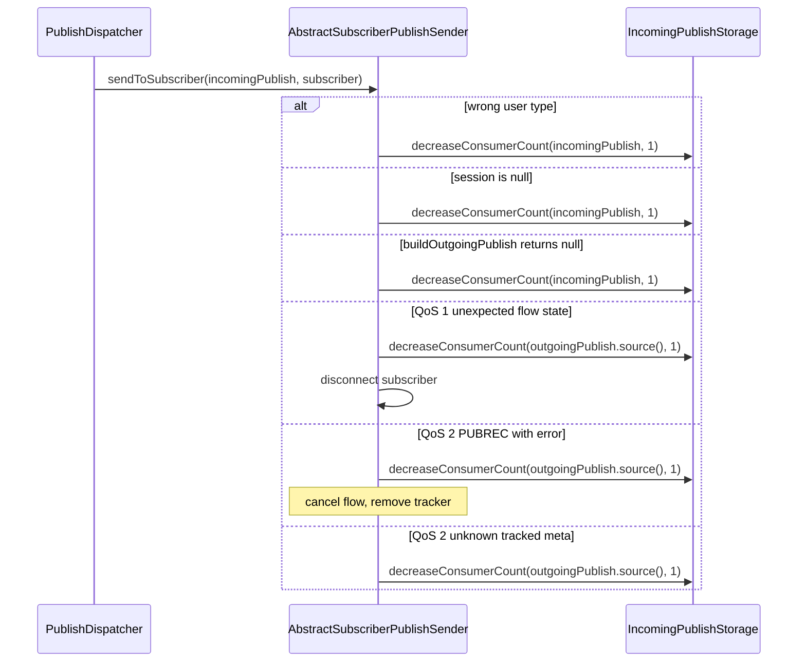
