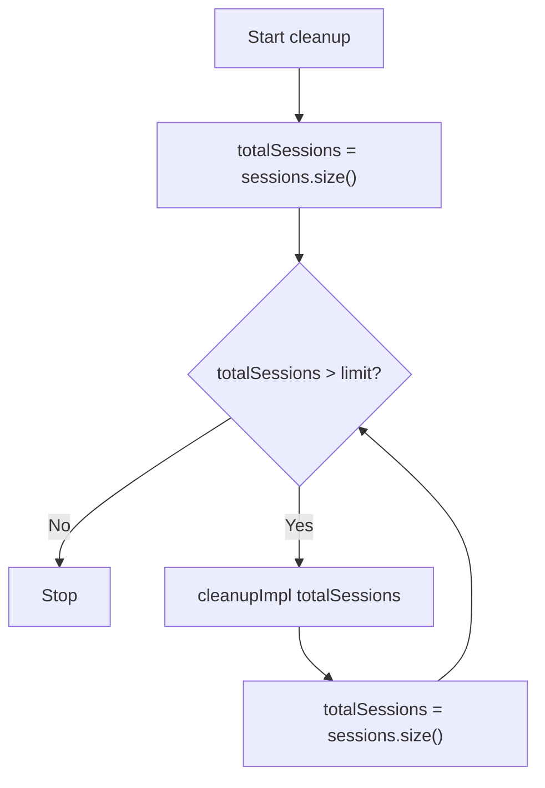
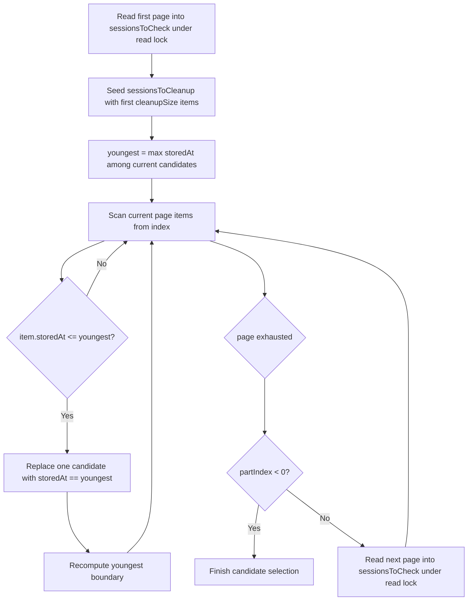
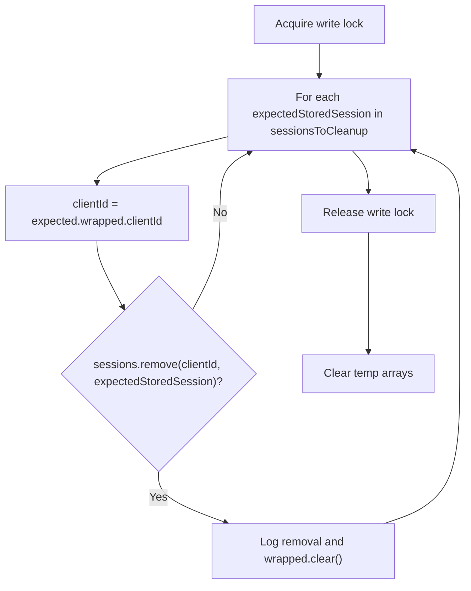

# OldestSessionCleaner algorithm

This document describes how `javasabr.mqtt.service.session.impl.OldestSessionCleaner` removes old stored sessions.

## Purpose

`OldestSessionCleaner` keeps the storage from growing indefinitely by repeatedly removing the oldest sessions in fixed-size batches while the total count is above the configured `limit`.

## Inputs and state

- `sessions`: lockable dictionary `clientId -> storedSession`
- `limit`: target upper bound for total stored sessions
- `cleanupBatchSize`: max number of candidates removed per cleanup pass
- `PART_SIZE` (`400`): pagination chunk size when reading dictionary values
- `storedAt`: timestamp used for age comparison (`smaller` = older)

Internal temporary arrays:

- `sessionsToCheck`: current paginated chunk
- `sessionsToCleanup`: selected oldest candidates for this pass

## High-level flow (`cleanup`)

Important: each loop removes at most `cleanupBatchSize`, then re-checks size and repeats until `size <= limit`.

## `cleanupImpl(totalSessions)` flow

### 1) Build candidate set of oldest sessions

`cleanupSize = min(cleanupBatchSize, totalSessions)`

The outer scan loop is additionally bounded by `maxIterations = 1000` as a safety guard.

### 2) Remove selected candidates

The conditional `remove(clientId, expectedStoredSession)` guarantees that only unchanged entries are deleted (safe under concurrent modifications).

## Replacement rule details

When a scanned session is old enough (`storedAt <= youngest`):

1. Find the first candidate whose `storedAt == youngest`.
2. Replace it with the scanned session.
3. Recompute `youngest` as the max `storedAt` in the updated candidate set.

This keeps `sessionsToCleanup` as a bounded set of the oldest sessions seen so far, without sorting all entries.

## Complexity

For one `cleanupImpl` pass:

- Dictionary scan: paginated over all stored sessions
- Candidate maintenance: linear in `cleanupBatchSize` per accepted replacement

Practical behavior is usually close to:

- Time: `O(totalSessions * cleanupBatchSize)` worst-case style bound
- Memory: `O(PART_SIZE + cleanupBatchSize)`

## Notes on ordering behavior

- Age ordering is based only on `storedAt`.
- If many sessions share the same `storedAt`, exact choice among ties depends on iteration order in paginated dictionary traversal.
- Across passes, cleanup remains bounded and safe, but tie-level determinism is not guaranteed.

